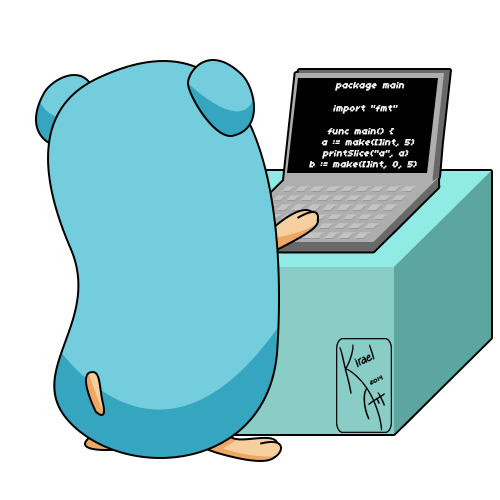

# Liedson
<!-- 
<div>

<p>Building applications with Golang</p>
<p>Building API's with Golang</p>

</div>

<div style="display: flex; justify-content: space-around; align-items: flex-start;">

<div>
    <h2 align="center">Languages</h2>
    <div style="display: flex; justify-content: space-around; align-items: center;">
        <div style="text-align: center; margin: 10px; border-radius: 8px; padding: 10px; transition: transform 0.2s, box-shadow 0.2s;">
            
            <p>Go</p>
        </div>
        <div style="text-align: center; margin: 10px; border-radius: 8px; padding: 10px; transition: transform 0.2s, box-shadow 0.2s;">
            
            <p>Python</p>
        </div>
        <div style="text-align: center; margin: 10px; border-radius: 8px; padding: 10px; transition: transform 0.2s, box-shadow 0.2s;">
            
            <p>C</p>
        </div>
    </div>
</div>

<div>
    <h2 align="center">Databases</h2>
    <div style="display: flex; justify-content: space-around; align-items: center;">
        <div style="text-align: center; margin: 10px;">
            
            <p>MySQL</p>
        </div>
        <div style="text-align: center; margin: 10px;">
            
            <p>MongoDB</p>
        </div>
    </div>
</div>

<div>
    <h2 align="center">Tools</h2>
    <div style="display: flex; justify-content: space-around; align-items: center;">
        <div style="text-align: center; margin: 10px;">
            
            <p>Postman</p>
        </div>
        <div style="text-align: center; margin: 10px;">
            
            <p>Git</p>
        </div>
    </div>
</div>


</div>


<p align="center">things i like</p>

<div style="display: flex; justify-content: space-around; align-items: center;">




</div>
<!-- </br> -->
<!-- 

<style>
    div > div > img {
        transition: transform 0.2s, box-shadow 0.2s;
    }

    div > div > img:hover {
        transform: scale(1.1);
        box-shadow: 0 4px 8px rgba
    }
</style>  -->

```json
{
  "name": "Fabrício Liedson",
  "profissao": "Backend Developer",
  "interesses": [
    "Desenvolvimento Web",
    "Inteligência Artificial",
    "Aprendizado de Máquina"
  ],
  "localizacao": "Sua Cidade, País",
  "contact": {
    "email": "fabricio.anjos@ufpi.edu.br",
    "linkedin": "https://linkedin.com/in/fabricioliedson",
    "github": "https://github.com/Liedsonfsa"
  },
  "languages": {
    "Go": "for backend development and build REST API's",
    "Python": ,
    "C": ,
    "HTML": ,
    "CSS": ,
  },
  "tools": [
    "Docker",
    "Postmam",
    "Git"
  ]
}
```

<!-- <div style="text-align: center;" align="center">
  <h3></h3> -->
  <!-- <br>
   -->

  <!-- <a href="https://github.com/igoov/github-readme-stats">
    
  </a>
</div> -->

<!-- Tools


          

          


          


 -->
